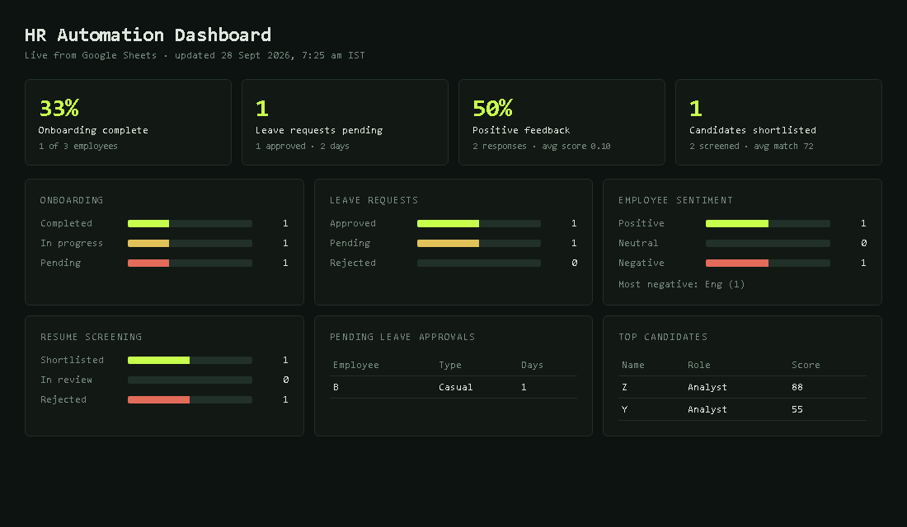
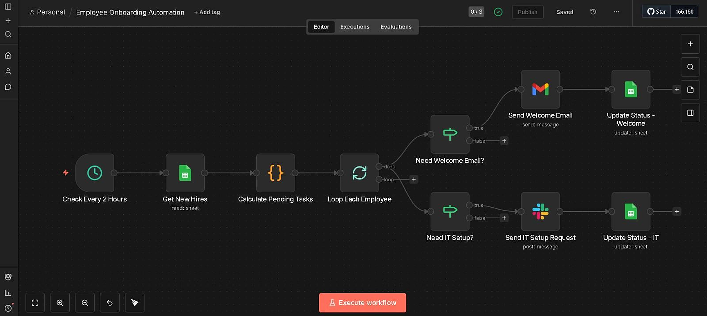
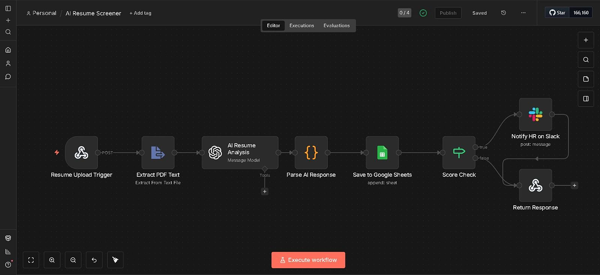
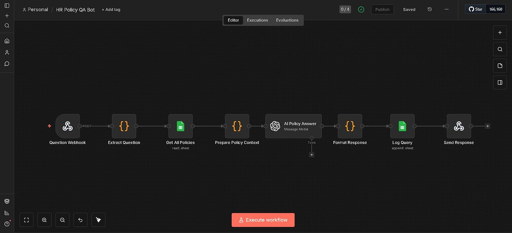
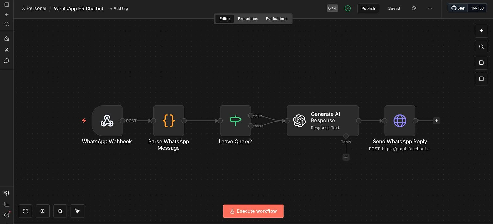

# AI-Powered HR Automation Suite

[](https://github.com/Nilesh-builds/ai-hr-automation-suite/actions/workflows/ci.yml)

> Rule-based baselines measured on small labeled samples (n=8–14 per task): leave type/duration 100%, date 75%, sentiment 90%, resume verdicts 87.5%, policy answers grounded 90%, chat intent 100%. Synthetic sample data only — no real employee records.

An end-to-end HR automation platform: seven n8n workflows **plus a Python-first
core engine** with a benchmarked evaluation harness, an SQLite data store, and
a live analytics dashboard.

Every automation that previously "used AI" can now be measured. Leave parsing,
sentiment analysis, resume screening, grounded policy Q&A, and chatbot intent
routing each ship with labeled datasets, rule-based baselines, and structured
metrics — run headless in CI, upgradeable to an LLM path with one env var.

- **Python-first core:** `aihr/intelligence/` is deterministic and testable
- **Evaluation harness:** labeled ground truth + strict/soft metrics per task
- **HR analytics dashboard:** Streamlit app over the SQLite store and eval report
- **Persistent storage:** SQLite (`HRStore`) replaces raw Google Sheets
- **n8n kept as reference:** the original seven workflows remain importable

## Quick start

```bash
pip install -e ".[dev]"
python -m aihr.eval.runner --print   # run the evaluation harness (no API key needed)
pytest                                # 37 tests, keyless
python -m aihr.seed                   # populate demo data into SQLite
streamlit run aihr/dashboard/app.py   # open the analytics dashboard
scripts/static_checks.py              # workflow JSON + credential hygiene
```

Set `OPENAI_API_KEY` in `.env` (see `.env.example`) to switch the intelligence
layer from rule-based baselines to GPT-4 for all five tasks.

## Evaluation harness

The suite no longer ships unmeasured AI. Each task maps to a labeled dataset
and a score.

| Task | Labeled data | Metrics |
| :-- | :-- | :-- |
| Leave request parsing | `leave_requests` | date accuracy, duration accuracy, type accuracy |
| Employee sentiment | `employee_feedback` | sentiment accuracy, macro-F1, urgency, attrition |
| Resume screening | `resumes` | verdict accuracy, score MAE, skill recall |
| Policy Q&A | `policies` + `policy_questions` | retrieval accuracy, grounded accuracy |
| Chat intent routing | `chat_messages` | intent accuracy, macro-F1 |

Latest rule-baseline report (regenerate with `python -m aihr.eval.runner`).
Small hand-labeled sample sets — every score below is shown with its n, so
treat percentages as indicative, not precise:

| Task | Metric | Score | n |
| :-- | :-- | :-- | --: |
| Leave parsing | Date accuracy | 75% (9/12) | 12 |
| Leave parsing | Duration accuracy | 100% (12/12) | 12 |
| Leave parsing | Type accuracy | 100% (12/12) | 12 |
| Sentiment | Sentiment accuracy | 90% (9/10) | 10 |
| Sentiment | Urgency accuracy | 100% (10/10) | 10 |
| Resume screening | Verdict accuracy | 87.5% (7/8) | 8 |
| Policy Q&A | Grounded accuracy | 90% (9/10) | 10 |
| Chat intent | Intent accuracy | 100% (14/14) | 14 |

All evaluation and demo data here is synthetic sample data: the seed store uses
invented employees (`aihr/seed.py`, seed 42) and the harness scores tiny
hand-labeled CSVs in `data/labeled/`. Nothing was tested on real employee data.

These are intentional, honest baselines: a couple of hard examples remain that
rules miss but the LLM layer fixes (e.g. "2.5 yrs with no cloud exposure" is
mis-classified as Weak by rules). Set the API key and re-run to see the
improvement.

## Analytics dashboard

```
streamlit run aihr/dashboard/app.py
```

Tabs: Overview · Sentiment · Leave · Resume · Policy QA · Evaluation. Charts are
Plotly, data comes from the SQLite store (auto-seeded on first launch), and the
Evaluation tab renders the latest harness report with a one-click re-run.

## Demo



Rendered output of `workflows/hr-dashboard.json` on tiny sample data
(3 employees, 2 leaves, 2 feedback responses, 2 candidates) — counts are
single digits by design, not production volumes.

Workflow canvases (click to enlarge):






Still to capture: leave-management-system, employee-sentiment-feedback-analyzer.

- **Screen recording:** short walkthrough (dashboard + one n8n import) — to be recorded.
- **n8n workflow canvases:** screenshots live in `docs/screenshots/` (one per
workflow, same names as `workflows/*.json`). To capture: open each JSON in n8n
(Import from File), arrange the canvas, export as PNG.
- Until then, every workflow is importable JSON verified by
`scripts/static_checks.py` (6 files, no secrets), and the Streamlit dashboard
runs the same logic end to end on synthetic data.

## Architecture

```
workflows/          n8n exports (importable reference)
aihr/
├── config.py       optional LLM credentials (.env)
├── models.py       dataclasses for all entities
├── store.py        SQLite persistence + queries
├── seed.py         synthetic demo data
├── intelligence/   leave · sentiment · resume · policy · onboarding · whatsapp
│                   (each: rule baseline + optional LLM path)
├── eval/           datasets · metrics · runner
└── dashboard/      Streamlit analytics app
data/labeled/       versioned ground-truth CSVs
data/reports/       generated eval_report.json (gitignored)
scripts/static_checks.py   CI static validation
```

See [`docs/architecture.md`](docs/architecture.md) for the full write-up and
design decisions.

## n8n workflows

The seven original workflows are kept under `workflows/` and remain importable:

| Workflow | Trigger | What it does |
| :-- | :-- | :-- |
| `employee-onboarding-automation.json` | Scheduled (every 2 hrs) | Scans upcoming hires, fires due onboarding tasks (welcome email, IT setup, day-1 checklist), updates status. |
| `leave-management-system.json` | Webhook | Parses a plain-language leave request, checks balance, auto-approves or routes to manager. |
| `employee-sentiment-feedback-analyzer.json` | Weekly + Webhook | Sends a mood-pulse survey, analyzes feedback, alerts HR on Slack when urgency is high. |
| `ai-policy-qa-bot.json` | Webhook | Answers policy questions strictly from the policy sheet, logs every query. |
| `ai-resume-screener-ranker.json` | Webhook (resume upload) | Extracts resume text, scores vs role requirements, pings Slack for strong candidates. |
| `whatsapp-hr-chatbot.json` | Webhook (WhatsApp) | Routes WhatsApp messages to answers for leave balance, policies, payslips. |
| `hr-dashboard.json` | Webhook + Schedule (weekdays 9am) | Serves a live KPI dashboard HTML from Google Sheets and posts a daily Slack digest. Read-only: writes nothing back. |

Import steps and credential/placeholder swap instructions match the original
setup. For a Python equivalent of every workflow, see the matching module in
`aihr/intelligence/`.

## Tech stack

- **Core engine:** Python 3.10+, pandas, NumPy, regex/lexicon heuristics, openai SDK
- **Persistence:** SQLite (`sqlite3`)
- **Dashboard:** Streamlit + Plotly
- **Orchestration (reference):** n8n, Google Sheets, Gmail, Slack, WhatsApp Business API
- **Quality:** pytest, GitHub Actions CI, static credential scanner

## Credential hygiene

No real API keys, sheet IDs, or tokens are committed anywhere. `.env.example`
documents available variables; CI runs `scripts/static_checks.py` to reject
accidentally committed secrets (`sk-*`, AWS keys, Slack tokens, OAuth ids).

## Roadmap (gaps that would take this further)

- Auth + rate limiting on the public webhooks before production
- Postgres/Airtable when data volume outgrows SQLite
- Approve/reject web page for leave management
- Multi-role resume comparison + calibration curve for screener scores
- Drift monitoring on sentiment / intent distributions across weeks

---

Built as a portfolio project exploring measurable AI plus workflow automation
for HR use cases.